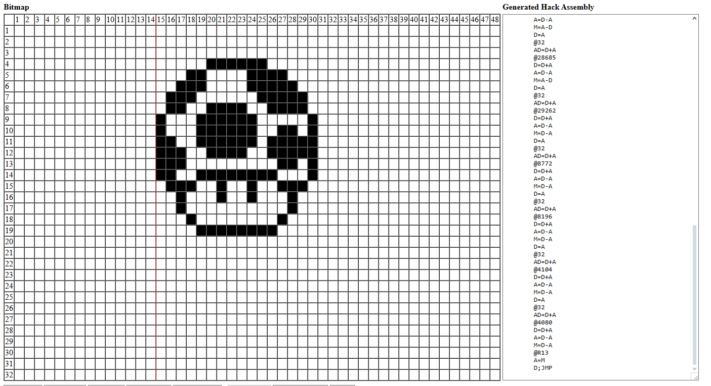
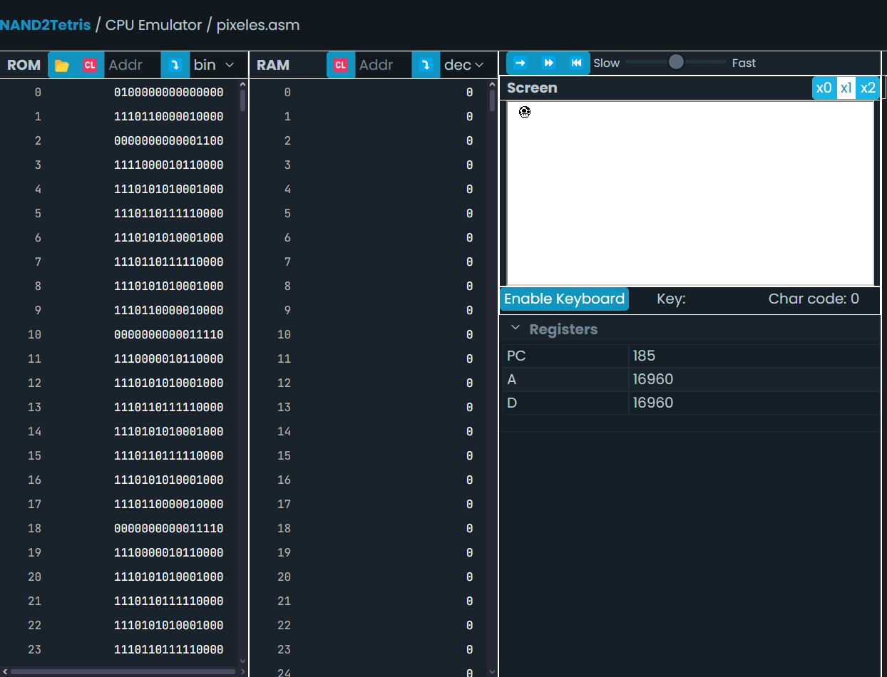

# Actividad 18

## Bitmap de Actividad 18


## Actividad 18 en NAND2TETRIS



## Código en assembler 

```asm
@SCREEN
	D=A
	@R12
	AD=D+M
	@2016 
	D=D+A 
	A=D-A 
	M=D-A 
	D=A 
	@32
	AD=D+A
	@7704 
	D=D+A 
	A=D-A 
	M=D-A 
	D=A 
	@32
	AD=D+A
	@15900 
	D=D+A 
	A=D-A 
	M=D-A 
	D=A 
	@32
	AD=D+A
	@31758 
	D=D+A 
	A=D-A 
	M=D-A 
	D=A 
	@32
	AD=D+A
	@31206 
	D=D+A 
	A=D-A 
	M=D-A 
	D=A 
	@32
	AD=D+A
	@31759 
	D=D+A 
	A=D-A 
	M=A-D 
	D=A 
	@32
	AD=D+A
	@19471 
	D=D+A 
	A=D-A 
	M=A-D 
	D=A 
	@32
	AD=D+A
	@1037 
	D=D+A 
	A=D-A 
	M=A-D 
	D=A 
	@32
	AD=D+A
	@1561 
	D=D+A 
	A=D-A 
	M=A-D 
	D=A 
	@32
	AD=D+A
	@20473 
	D=D+A 
	A=D-A 
	M=A-D 
	D=A 
	@32
	AD=D+A
	@28685 
	D=D+A 
	A=D-A 
	M=A-D 
	D=A 
	@32
	AD=D+A
	@29262 
	D=D+A 
	A=D-A 
	M=D-A 
	D=A 
	@32
	AD=D+A
	@8772 
	D=D+A 
	A=D-A 
	M=D-A 
	D=A 
	@32
	AD=D+A
	@8196 
	D=D+A 
	A=D-A 
	M=D-A 
	D=A 
	@32
	AD=D+A
	@4104 
	D=D+A 
	A=D-A 
	M=D-A 
	D=A 
	@32
	AD=D+A
	@4080 
	D=D+A 
	A=D-A 
	M=D-A 
	@R13
	A=M
	D;JMP
```