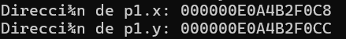

# Sesión 1

Analicemos el siguiente caso de estudio, miremos la clase particle:

```cpp
class Particle {
public:
    float x, y;
    void move(float dx, float dy) {
        x += dx;
        y += dy;
    }
};
```

## - ¿Qué representa la clase Particle?

La clase particle representa el movimiento de una partícula en un espacio bidimensional el cual tiene estados determinados por `x` y `y` y un comportamiento determinado por el método `move`.

## - ¿Cómo interactúan sus atributos y métodos?

### **Atributos**

- En la clase `Particle` si se observa el código, `x` y `y` son miembros de datos

- Cada instancia de `Particle` tiene su respectiva copia de `x` y `y`

- Se encarga de representar el estado de esa partícula en particular 

### **Comportamientos** 

- `Move()` es un método miembro: es una función que está asociada a un objeto en especifico.
---

# Explorando la memoria 

## - ¿Los atributos están almacenados de forma contigua?

Si, efectivamente, revisemos la actividad que se plantea en el Notion:



Revisemos los últimos dígitos, podemos ver un `8` y una `C` recordemos que el formato en que se enumeran las direcciones de memoria se hacen bajo el formato de `base 16` donde las direcciones se enumeran de `0 al 9` y de `A a F` se supone que `p1.x` al igual que `p1.y` ocupa un total de 4 bytes, si contamos desde el `8` llegamos hasta la `B` lo que da un total de 4 bytes y si prestamos atención, después de esta `B` es que comienza el siguiente atributo en `C` por lo que podemos decir que efectivamente, los atributos se almacenan de una forma contigua.

## - ¿Qué indica el tamaño del objeto sobre su estructura interna?

Refleja la memoria necesaria para almacenar su estado interno (atributos de instancia + padding + punteros ocultos como vtables si aplica). Este **NO** incluye métodos ni atributos estáticos.

---

# Análisis de diferencias 

## - ¿Cómo afectan los tributos estáticos al tamaño de la instancia?

No lo afectan. Entendamos algo los tributos normales viven dentro de cada instancia, es decir, que cualquiera de estos afectan directamente el tamaño de la clase.

Por otro lado, los atributos estáticos están ubicados en una zona global (un segmento de datos estáticos) por lo que no forman parte del objeto.

## - ¿Qué diferencias hay entre datos estáticos y dinámicos en términos de memoria?

Los datos estáticos se guardan en la zona de memoria estática (segmento *data*) y se reservan en el tiempo de carga del programa y duran toda la ejecución, estos tienen una única dirección fija en la memoria

Por otra parte, los datos dinámicos se crean en el heap con el `new`, `malloc` u otro gestor de memoria, estos no existen hasta que son llamados por una función de una forma explícita, su tamaño se decide en el tiempo de ejecución y su tiempo de vida es hasta que estos son liberados (funciones como `delete`) o hasta que el programa termine, en caso de que se olvide de hacer la libración, van a haber fugas de memoria.

# Reflexión 


Es un bloque de datos contiguos que representan el estado definido por la clase. Los métodos no forman parte de ese bloque, sino que se almacenan por aparte y son accesibles a través del tipo. Comprender esto permite diseñar clases eficientes, evitando la duplciación de datos y optimizando la memoria.


# Sesión 2  

En esta sesión exploramos cómo se ubican en memoria los **datos** y los **métodos** de una clase, además de entender qué son las **vtables** y cómo funcionan con los métodos virtuales.  

---

## - ¿Dónde se almacenan los datos y métodos de una clase en C++ en la memoria?  

- **Datos (atributos):**  
  - Si el objeto se crea en una función normal, se guardan en el **stack**.  
  - Si el objeto se crea con `new`, se guardan en el **heap**.  

- **Métodos:**  
  No forman parte del objeto. Están en una zona separada llamada **segmento de código** o *text section*.  

- **Vtable:**  
  Es una tabla interna que el compilador crea cuando hay métodos **virtuales**. Guarda las direcciones de las funciones que deben llamarse según el tipo real del objeto.  

---

## - ¿Cómo se implementan los métodos virtuales en C++?  

Los métodos virtuales se implementan con una **vtable (Virtual Table)**:  

- Cada clase con métodos virtuales tiene su propia vtable.  
- Cada objeto de esa clase guarda un **puntero oculto** que apunta a la vtable.  
- Cuando se llama a un método virtual, el programa consulta esa vtable para saber qué función ejecutar.  

Esto hace posible el **polimorfismo**: que una clase derivada cambie el comportamiento de un método y que se ejecute el correcto en tiempo de ejecución.  

---

## - ¿En qué parte de la memoria se encuentran las vtable de cada objeto?  

Las vtables no se guardan dentro del objeto mismo, sino en una zona especial de memoria (generalmente en la sección de **datos estáticos**).  
Cada objeto solo guarda un **puntero** a su vtable.  

---

## - ¿Cómo afecta la presencia de métodos virtuales al tamaño del objeto?  

El objeto aumenta de tamaño porque ahora incluye un **puntero extra** a la vtable (4 bytes en sistemas de 32 bits, 8 bytes en sistemas de 64 bits).  
Este puntero se suma a los atributos que ya tenía la clase.  

---

## - ¿Qué papel juegan las vtables en el polimorfismo?  

Las vtables son las que hacen posible que un mismo método pueda comportarse de manera diferente según el tipo del objeto.  
Ejemplo:  
- Un puntero `Base*` puede apuntar a un `Derived`.  
- Cuando se llama a `display()`, la vtable asegura que se ejecute `Derived::display` y no `Base::display`.  

---

## - ¿Qué diferencia hay entre punteros a funciones y punteros a métodos miembro en C++?  

- **Punteros a funciones:**  
  - Se pueden guardar en atributos.  
  - Son direcciones a funciones globales o estáticas.  
  - Ocupan espacio directamente en el objeto si son atributos.  

- **Punteros a métodos miembro:**  
  - Se usan para apuntar a funciones que necesitan un objeto específico para ejecutarse.  
  - No se pueden usar sin asociarlos a una instancia de la clase.  

**Diferencias en memoria y rendimiento:**  
- Un puntero a función es más directo (apunta a una sola función).  
- Un puntero a método necesita información extra porque debe ligarse a un objeto.  
- La **vtable** es automática: el compilador la maneja y permite polimorfismo sin que el programador tenga que asignar punteros manualmente.  

---

#  Mini Experimentos – Sesión 2  

## 1. ¿Cómo cambia el tamaño de un objeto con métodos virtuales?  

```cpp
#include <iostream>
using namespace std;

class SinVirtual {
public:
    int x;
};

class ConVirtual {
public:
    int x;
    virtual void show() {}
};

int main() {
    cout << "Tamaño de clase sin virtual: " << sizeof(SinVirtual) << " bytes" << endl;
    cout << "Tamaño de clase con virtual: " << sizeof(ConVirtual) << " bytes" << endl;
}
```

**Resultado esperado:**  
- La clase con método virtual (`ConVirtual`) ocupa **más memoria** porque guarda un puntero oculto a la vtable.  

---

## 2. Ver direcciones de atributos en memoria  

```cpp
#include <iostream>
using namespace std;

class Test {
public:
    int a;
    int b;
};

int main() {
    Test obj;
    cout << "Direccion de obj.a: " << &obj.a << endl;
    cout << "Direccion de obj.b: " << &obj.b << endl;
}
```

**Observación:**  
Las direcciones se ven una seguida de la otra (son contiguas), lo que confirma que los atributos se almacenan en bloque dentro del objeto.  

---

## 3. Ver la dirección de la vtable  

```cpp
#include <iostream>
using namespace std;

class Base {
public:
    virtual void display() {
        cout << "Base display" << endl;
    }
};

class Derived : public Base {
public:
    void display() override {
        cout << "Derived display" << endl;
    }
};

int main() {
    Base b;
    Derived d;

    // El primer puntero oculto dentro del objeto apunta a la vtable
    cout << "Direccion de vtable de Base: " << *(void**)&b << endl;
    cout << "Direccion de vtable de Derived: " << *(void**)&d << endl;
}
```

**Resultado esperado:**  
- Se imprimen dos direcciones diferentes.  
- Esto prueba que cada clase con métodos virtuales tiene su **propia vtable**.  

---

## 4. Comparando punteros a funciones y métodos  

```cpp
#include <iostream>
using namespace std;

class FunctionPointerExample {
public:
    void (*funcPtr)(); // puntero a función

    static void staticFunction() {
        cout << "Static function called" << endl;
    }

    void assignFunction() {
        funcPtr = staticFunction;
    }
};

class MethodPointerExample {
public:
    void memberFunction() {
        cout << "Member function called" << endl;
    }
};

int main() {
    FunctionPointerExample f;
    f.assignFunction();
    f.funcPtr(); // llama a la función estática

    // Puntero a método miembro
    void (MethodPointerExample::*methodPtr)() = &MethodPointerExample::memberFunction;

    MethodPointerExample obj;
    (obj.*methodPtr)(); // llama al método de obj
}
```

**Observación:**  
- El puntero a función (`funcPtr`) apunta directo a una función estática.  
- El puntero a método miembro (`methodPtr`) necesita asociarse a un objeto específico (`obj`).  

---

# Reflexión  

- Los **atributos** de un objeto viven en el stack o heap.  
- Los **métodos** no están en el objeto, sino en la sección de código.  
- Si hay métodos **virtuales**, aparece la vtable, que se guarda en una zona de datos estáticos, y cada objeto guarda un puntero hacia ella.  
- Los **punteros a funciones** se parecen a las vtables pero los controla el programador y ocupan espacio dentro del objeto.  

---

## Conclusión  

Comprender cómo se organizan los datos, los métodos y las vtables en memoria me ayuda a diseñar clases de forma más consciente. Sé que los métodos virtuales añaden un costo en tamaño y en tiempo (porque se consulta la tabla), pero permiten polimorfismo. Por eso, hay que usarlos cuando realmente se necesite flexibilidad y herencia.  


# Sesión 3: Implementación Interna de Encapsulamiento, Herencia y Polimorfismo

## Objetivo
Entender cómo se implementan las abstracciones del encapsulamiento, herencia y polimorfismo a nivel interno.

---

## Encapsulamiento

### Concepto
El encapsulamiento es el principio que restringe el acceso directo a los datos de un objeto.  
En C++, se logra con los **modificadores de acceso**: `private`, `protected` y `public`.  
Importante: el compilador aplica estas restricciones **en tiempo de compilación**, no en ejecución. Los miembros privados siguen estando en memoria.

### Ejemplo básico

```cpp
class AccessControl {
private:
    int privateVar;
protected:
    int protectedVar;
public:
    int publicVar;
    AccessControl() : privateVar(1), protectedVar(2), publicVar(3) {}
};

int main() {
    AccessControl ac;
    ac.publicVar = 10; // Válido
    // ac.protectedVar = 20; // Error de compilación
    // ac.privateVar = 30;   // Error de compilación
}
```

**Reflexión:**  
Aunque los atributos privados y protegidos ocupan memoria, el compilador prohíbe su acceso directo desde fuera de la clase. Esta es una **barrera lógica, no física**.

---

### Mini Experimento: Rompiendo el encapsulamiento

```cpp
#include <iostream>
using namespace std;

class MyClass {
private:
    int secret1;
    float secret2;
    char secret3;

public:
    MyClass(int s1, float s2, char s3) : secret1(s1), secret2(s2), secret3(s3) {}

    void printMembers() const {
        cout << "secret1: " << secret1 << "\n";
        cout << "secret2: " << secret2 << "\n";
        cout << "secret3: " << secret3 << "\n";
    }
};

int main() {
    MyClass obj(42, 3.14f, 'A');

    // Hack con reinterpret_cast
    int* ptrInt = reinterpret_cast<int*>(&obj);
    float* ptrFloat = reinterpret_cast<float*>(ptrInt + 1);
    char* ptrChar = reinterpret_cast<char*>(ptrFloat + 1);

    cout << "Accediendo directamente a los miembros privados:\n";
    cout << "secret1: " << *ptrInt << "\n";
    cout << "secret2: " << *ptrFloat << "\n";
    cout << "secret3: " << *ptrChar << "\n";
}
```

**Resultados esperados:**  
- Se muestran los valores de `secret1`, `secret2` y `secret3` aunque son privados.  
- Esto demuestra que el encapsulamiento en C++ depende solo del compilador.  

**Reflexión:**  
- El encapsulamiento es **una convención de seguridad**, no una barrera absoluta.  
- Técnicas como `reinterpret_cast` permiten violar esa regla, pero comprometen la seguridad y estabilidad del programa.  

---

## Herencia y memoria

### Concepto
En herencia, los objetos derivados incluyen primero los atributos de la clase base y luego los propios.  

### Ejemplo

```cpp
#include <iostream>
using namespace std;

class Base {
public:
    int baseVar;
};

class Derived : public Base {
public:
    int derivedVar;
};

int main() {
    Derived d;
    cout << "Direccion de d: " << &d << endl;
    cout << "Direccion de d.baseVar: " << &(d.baseVar) << endl;
    cout << "Direccion de d.derivedVar: " << &(d.derivedVar) << endl;
}
```

**Resultados esperados:**  
- `d.baseVar` aparece en memoria antes que `d.derivedVar`.  
- Esto confirma que la clase derivada contiene una copia embebida de la clase base.  

**Reflexión:**  
La herencia es esencialmente **composición con prioridad**, ya que los miembros de la base se almacenan físicamente dentro del objeto derivado.

---

## Polimorfismo y Vtables

### Concepto
El polimorfismo permite que distintas clases compartan una interfaz común.  
En C++, se implementa con **vtables**: tablas de punteros a funciones virtuales.

### Ejemplo

```cpp
#include <iostream>
using namespace std;

class Animal {
public:
    virtual void makeSound() {
        cout << "Some generic sound" << endl;
    }
};

class Dog : public Animal {
public:
    void makeSound() override {
        cout << "Bark" << endl;
    }
};

class Cat : public Animal {
public:
    void makeSound() override {
        cout << "Meow" << endl;
    }
};

int main() {
    Animal* animals[] = { new Dog(), new Cat() };
    for (Animal* animal : animals) {
        animal->makeSound();
    }
}
```

**Resultados esperados:**  
- El programa imprime `Bark` y `Meow`.  
- En tiempo de ejecución, el objeto usa su **vtable** para decidir qué método ejecutar.  

**Reflexión:**  
- Cada clase polimórfica tiene su propia vtable.  
- El objeto guarda un puntero oculto a esa tabla.  
- El polimorfismo tiene un pequeño costo en rendimiento por la indirección, pero ofrece gran flexibilidad.

---

## Reflexión Final

1. **Encapsulamiento:** protege los datos a nivel lógico, aunque puede romperse con hacks de bajo nivel.  
2. **Herencia:** organiza los atributos de la base y la derivada en una estructura continua en memoria.  
3. **Polimorfismo:** se implementa con vtables, resolviendo métodos virtuales en tiempo de ejecución.  

**Ventajas:**  
- Mejor organización del código.  
- Reutilización y flexibilidad.  

**Desventajas:**  
- Ligero costo en memoria (punteros ocultos).  
- Complejidad en el control del acceso y seguridad.  

---
