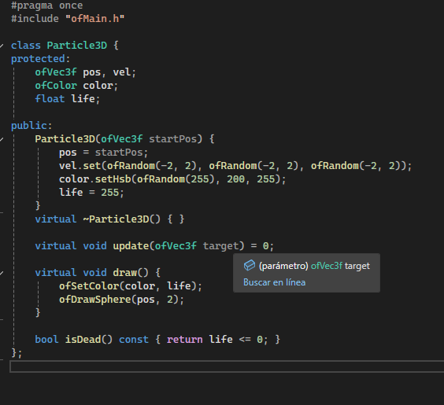
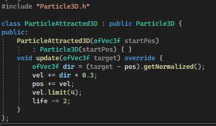
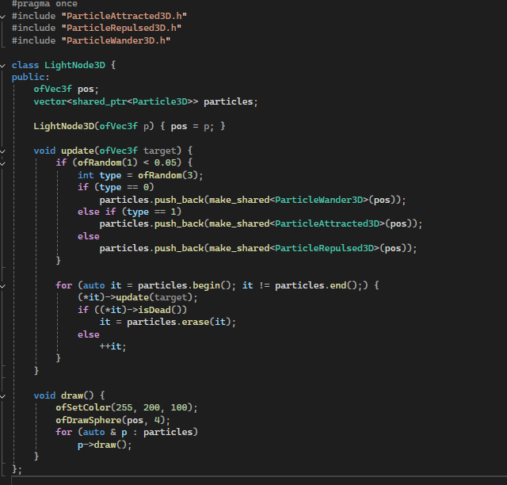
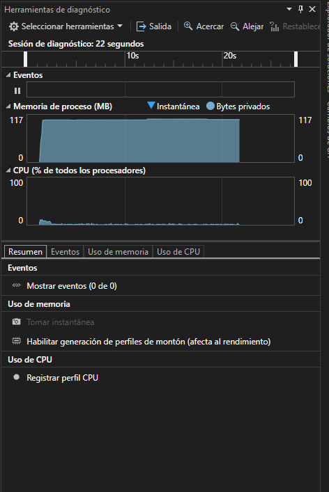

# Reto

## 1. Introducción

En este proyecto se desarrolló un sistema de arte generativo usando openFrameworks y C++. La idea principal fue crear un árbol 3D con ramas y luces que generan partículas con diferentes comportamientos. Para lograrlo, se aplicaron conceptos fundamentales de la programación orientada a objetos (OOP), como el encapsulamiento, la herencia y el polimorfismo. Esto permitió organizar el código de forma clara, reutilizable y fácil de entender.

El proyecto no solo busca crear una imagen visual atractiva, sino también entender cómo las abstracciones de OOP afectan la estructura y el rendimiento del programa.

---

## 2. Diseño y Desarrollo

### 2.1. Encapsulamiento

El encapsulamiento es la forma de proteger los datos dentro de una clase para que solo se puedan modificar mediante métodos específicos. En el proyecto, cada partícula tiene su propia posición, velocidad, color y vida, que están protegidos dentro de la clase `Particle3D`. Esto evita que otras partes del programa cambien estos valores directamente y cause errores.

Por ejemplo, la clase base `Particle3D` tiene variables protegidas como `pos` (posición), `vel` (velocidad), `color` y `life` (vida). Solo los métodos dentro de la clase o sus derivadas pueden acceder o modificar estos datos.

```cpp
class Particle3D {
protected:
    ofVec3f pos, vel;
    ofColor color;
    float life;
    // ...
};
```

Esto ayuda a mantener el control sobre cómo se comportan las partículas y facilita la depuración.



### 2.2. Herencia
La herencia permitió crear diferentes tipos de partículas que comparten características comunes, pero con comportamientos distintos. Por ejemplo, todas las partículas heredan de `Particle3D`, pero luego hay clases específicas como:

`ParticleAttracted3D`: partículas que se mueven hacia un objetivo.
`ParticleRepulsed3D`: partículas que se alejan de un objetivo.
`ParticleWander3D`: partículas que se mueven de forma errática.
Cada una de estas clases redefine el método `update()` para cambiar su comportamiento, pero todas comparten las propiedades básicas de la clase base.

```cpp
class ParticleAttracted3D : public Particle3D {
public:
```

Esto hace que el código sea más organizado y evita repetir código.


### 2.3 Polimorfismo

El polimorfismo permitió manejar diferentes tipos de partículas usando punteros a la clase base Particle3D. Así, se puede tener un vector que contenga partículas de distintos tipos y llamar a sus métodos `update()` y `draw()` sin tener que procuparse por qué tipo específico son.

Por ejemplo, en la clase `LightNode3D` se almacenan partículas en un vector de `shared_ptr<Particle3D>`. Cuando se actualizan o dibujan, se llama al método correspondiente de cada tipo de partícula gracias al polimorfismo.

```cpp
vector<shared_ptr<Particle3D>> particles;
```

Esto facilita la extensión del sistema, ya que se pueden agregar nuevos tipos de partículas sin cambiar el código que las maneja.


---

## 3. Experimentación y Optimización
### 3.1. Medición de rendimiento

Para entender cómo afectaban mis decisiones de diseño al rendimiento, utilicé las herramientas de Visual Studio para medir el uso de memoria y el tiempo que tarda el programa en actualizar y dibujar las partículas.

Se descubrió que el uso de métodos virtuales (como `update()` y `draw()`) tiene un pequeño costo extra porque el programa debe decidir en tiempo de ejecución qué función llamar (esto se llama despacho dinámico). Sin embargo, este costo es aceptable para la flexibilidad que ofrece.



### 3.2. Optimización aplicada
Para mejorar el rendimiento, hice lo siguiente:

- Se evitó usar métodos virtuales en clases donde no era necesario.
- Usé `shared_ptr` para manejar la memoria automáticamente y evitar fugas.
- Limité la cantidad de partículas que se crean en cada actualización para no saturar el sistema.
- Limité la velocidad máxima de las partículas para evitar movimientos muy rápidos que puedan causar problemas visuales o de cálculo.

Estas mejoras ayudaron a que el programa corriera de forma más fluida sin perder la calidad visual.

## 4. Reflexión y Ajuste Final
- Encapsulamiento: Me ayudó a mantener el control sobre los datos de cada partícula, evitando errores y facilitando el mantenimiento del código.
- Herencia: Fue muy útil para crear diferentes comportamientos sin repetir código, haciendo el proyecto más escalable.
- Polimorfismo: Simplificó la gestión de múltiples tipos de partículas, aunque tuve que ser cuidadoso con el impacto en el rendimiento.
- Desafíos: El principal reto fue balancear un diseño limpio y orientado a objetos con la necesidad de que el programa corriera rápido y sin problemas. Lo superé haciendo pruebas y optimizando poco a poco.
Aprendizaje: Entendí que la programación orientada a objetos no solo es para organizar el código, sino que también influye en cómo funciona el programa internamente y en su eficiencia.

## 5. Evidencias de Resultados de Aprendizaje
### RAE1: Construcción de la aplicación
El proyecto cumple con los requisitos funcionales: 
Se genera un árbol 3D con ramas y luces que emiten partículas con comportamientos variados.

Se adjunta un video que muestra:
- El árbol completo con sus ramas y luces.
- Partículas que se mueven hacia el cursor (atracción).
- Partículas que se alejan del cursor (repulsión).
- Partículas que se mueven de forma errática (wander).

---


<video controls src="../ImagenesYVideos/Grabación de pantalla 2025-09-30 000209.mp4" title="Title"></video>


### RAE2: Pruebas y aseguramiento de calidad

- Se realizaron pruebas para verificar que las partículas se crean, actualizan y eliminan correctamente cuando su vida termina.
- Se midió el rendimiento antes y después de aplicar optimizaciones, mostrando mejoras en la fluidez.
- Se verificó que el uso de memoria es estable y no hay fugas gracias al uso de `shared_ptr`.
- Se documentaron los resultados y se ajustó el código para cumplir con buenas prácticas de OOP.